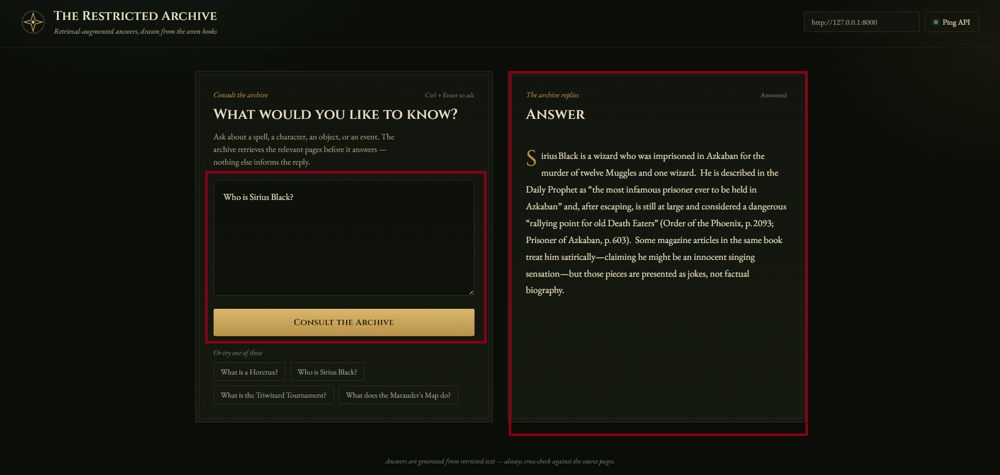

# 📖 The Restricted Archive — Harry Potter RAG

A **Retrieval-Augmented Generation (RAG)** system that answers questions about the *Harry Potter* books using **only the content retrieved from the books themselves**.

Ask about a character, spell, object, place, or event. The system retrieves the most relevant passages from the book collection using **semantic search with ChromaDB**, then passes the retrieved context to a **Groq-powered LLM** to generate a grounded answer.

The goal is simple:

> **No outside knowledge. No invented lore. Answers are grounded in the retrieved book content.**



---

## ✨ Features

* 📚 **Book-grounded answers** — responses are generated from retrieved book passages.
* 🔎 **Semantic retrieval** — questions are converted into embeddings and searched against the vector database.
* 🧠 **LLM-powered query routing** — questions are classified before retrieval.
* 🚫 **Off-topic filtering** — unrelated questions can be rejected before accessing the knowledge base.
* 💬 **Natural-language questions** — ask questions about characters, spells, objects, events, and more.
* ⚡ **Streaming responses** — generated answers are streamed back to the frontend.
* 🌐 **Simple web interface** — built with HTML, CSS, and vanilla JavaScript.
* 🔌 **REST API** — FastAPI provides the backend API.

---

## 🧠 How It Works

The system follows a complete RAG pipeline:

```text
                         User Question
                              │
                              ▼
                    ┌───────────────────┐
                    │     Frontend      │
                    │   HTML / CSS / JS │
                    └─────────┬─────────┘
                              │
                              │ HTTP Request
                              ▼
                    ┌───────────────────┐
                    │   FastAPI Backend │
                    └─────────┬─────────┘
                              │
                              ▼
                    ┌───────────────────┐
                    │    QueryRouter    │
                    │                   │
                    │ retrieve /        │
                    │ chitchat /        │
                    │ off-topic         │
                    └───────┬───────────┘
                            │
                    retrieve question
                            │
                            ▼
                    ┌───────────────────┐
                    │     Retriever     │
                    │                   │
                    │ Query Embedding   │
                    │        ↓          │
                    │ Semantic Search   │
                    └─────────┬─────────┘
                              │
                              ▼
                    ┌───────────────────┐
                    │     ChromaDB      │
                    │                   │
                    │ Harry Potter      │
                    │ Book Chunks       │
                    └─────────┬─────────┘
                              │
                       Retrieved Context
                              │
                              ▼
                    ┌───────────────────┐
                    │ AnswerGenerator  │
                    │                   │
                    │ Groq LLM +        │
                    │ Retrieved Context │
                    └─────────┬─────────┘
                              │
                         Final Answer
                              │
                              ▼
                    ┌───────────────────┐
                    │     Frontend      │
                    │   Result Panel    │
                    └───────────────────┘
```

### Pipeline

1. The user submits a question through the frontend.
2. The question is sent to the FastAPI backend.
3. **QueryRouter** determines whether the question requires retrieval, is casual conversation, or is unrelated to the book collection.
4. For retrieval questions, the query is converted into an embedding using a Sentence Transformer model.
5. **ChromaDB** performs semantic similarity search against the stored book chunks.
6. The most relevant passages are retrieved.
7. **AnswerGenerator** sends the question and retrieved context to the Groq LLM.
8. The LLM generates an answer using the retrieved context.
9. The answer is streamed back to the frontend.

If the retrieved context does not contain enough information, the system is instructed **not to invent an answer**.

---

## 🏗️ Architecture

```text
┌─────────────────────┐
│                     │
│      Frontend       │
│    HTML / CSS / JS  │
│                     │
└──────────┬──────────┘
           │
           │ HTTP
           ▼
┌─────────────────────┐
│                     │
│    FastAPI Backend  │
│                     │
└──────────┬──────────┘
           │
     ┌─────┼──────┐
     │     │      │
     ▼     ▼      ▼
┌────────┐ ┌────────────┐ ┌───────────────┐
│ Query  │ │ Retriever  │ │ Answer        │
│ Router │ │            │ │ Generator     │
└────────┘ └─────┬──────┘ └───────┬───────┘
                 │                │
                 ▼                ▼
          ┌─────────────┐  ┌──────────────┐
          │  ChromaDB   │  │   Groq LLM   │
          │ Vector Store│  │              │
          └─────────────┘  └──────────────┘
```

---

## 🛠️ Tech Stack

| Layer                  | Technology                       |
| ---------------------- | -------------------------------- |
| Frontend               | HTML, CSS, Vanilla JavaScript    |
| Backend                | FastAPI                          |
| API Server             | Uvicorn                          |
| Vector Database        | ChromaDB                         |
| Embeddings             | `intfloat/multilingual-e5-large` |
| Embedding Framework    | Sentence Transformers            |
| Query Routing          | Groq LLM                         |
| Answer Generation      | Groq LLM                         |
| LLM Integration        | LangChain Groq                   |
| Environment Management | python-dotenv                    |
| Data                   | Harry Potter book collection     |

---

## 📦 Main Dependencies

The project uses the following main Python packages:

```text
chromadb
fastapi
uvicorn
langchain-core
langchain-groq
pydantic
python-dotenv
sentence-transformers
```

All Python dependencies are listed in:

```text
backend/requirements.txt
```

Install them using:

```bash
pip install -r requirements.txt
```

---

## 📁 Project Structure

```text
Rag_Assistant/
│
├── backend/
│   ├── .env
│   ├── requirements.txt
│   │
│   ├── app/
│   │   ├── main.py
│   │   │
│   │   ├── api/
│   │   │   └── routes/
│   │   │       └── query.py
│   │   │
│   │   └── services/
│   │       ├── router.py
│   │       ├── retrieval.py
│   │       └── generator.py
│   │
│   └── data/
│       └── vector_store/
│           └── chroma_data/
│
├── frontend/
│   └── index.html
│
├── demo-screenshot.png
├── README.md
└── .gitignore
```

### Backend Components

#### `main.py`

Initializes the FastAPI application, configures CORS, and registers the API routes.

#### `router.py`

Contains the **QueryRouter**, which determines how the incoming question should be handled.

Possible categories include:

* `retrieve`
* `chitchat`
* `off-topic`

#### `retrieval.py`

Responsible for:

* Loading the embedding model.
* Converting the user's question into an embedding.
* Searching ChromaDB.
* Returning the most relevant book chunks.

#### `generator.py`

Responsible for:

* Building the final prompt.
* Providing retrieved context to the LLM.
* Generating the grounded answer.
* Streaming the response to the frontend.

---

# 🚀 Getting Started

## 1. Clone the Repository

```bash
git clone https://github.com/loubid/Rag_Assistant.git
cd Rag_Assistant
```

---

## 2. Create a Virtual Environment

```bash
python -m venv .venv
```

Activate it on Windows:

```bash
.venv\Scripts\activate
```

On Linux/macOS:

```bash
source .venv/bin/activate
```

---

## 3. Install Dependencies

Navigate to the backend:

```bash
cd backend
```

Then install the required packages:

```bash
pip install -r requirements.txt
```

---

## 4. Configure the Environment

Create a `.env` file inside the `backend` directory:

```env
GROQ_API_KEY=your_groq_api_key
GROQ_MODEL=your_groq_model
```

Replace the values with your own Groq API credentials.

> **Never commit your `.env` file or expose your API key publicly.**

---

## 5. Run the Backend

From the `backend` directory:

```bash
uvicorn app.main:app --reload
```

The API will be available at:

```text
http://127.0.0.1:8000
```

You can also access the FastAPI documentation at:

```text
http://127.0.0.1:8000/docs
```

---

## 6. Run the Frontend

Open a new terminal and navigate to the frontend:

```bash
cd frontend
```

Start a simple HTTP server:

```bash
python -m http.server 5500
```

Then open:

```text
http://127.0.0.1:5500
```

Make sure the API endpoint in the frontend points to:

```text
http://127.0.0.1:8000
```

You can use the **Ping API** button to verify that the backend is running.

---

# 🔌 API

| Method | Endpoint  | Description                                        |
| ------ | --------- | -------------------------------------------------- |
| `GET`  | `/`       | Returns the basic API status                       |
| `GET`  | `/health` | Checks backend health                              |
| `POST` | `/query/` | Processes a question and returns a grounded answer |

### Health Check

```http
GET /health
```

Example response:

```json
{
  "status": "healthy"
}
```

### Query

```http
POST /query/
```

The endpoint accepts a user question and returns an answer generated from the retrieved book context.

---

# 💬 Example Questions

Try questions such as:

* **What is a Horcrux?**
* **Who is Sirius Black?**
* **What is the Triwizard Tournament?**
* **What does the Marauder's Map do?**
* **Who created the Marauder's Map?**
* **What happened in the Chamber of Secrets?**

The system is designed to answer using the information available in the indexed book content.

---

# 🔍 Retrieval System

The retrieval stage uses:

```text
intfloat/multilingual-e5-large
```

to transform both the user query and book chunks into vector representations.

These embeddings are stored in **ChromaDB**, allowing the system to retrieve passages based on semantic similarity rather than simple keyword matching.

```text
User Question
      │
      ▼
Embedding Model
      │
      ▼
Query Vector
      │
      ▼
ChromaDB Similarity Search
      │
      ▼
Relevant Book Chunks
      │
      ▼
Groq LLM
      │
      ▼
Grounded Answer
```

---

# 🛡️ Grounding & Hallucination Control

A key design goal of the system is to reduce hallucinations.

The LLM receives:

```text
User Question
       +
Retrieved Book Context
```

and is instructed to base its answer **only on the provided context**.

If the retrieved passages do not contain sufficient information, the system should indicate that the information cannot be determined from the available context instead of relying on external knowledge.

---

# 🚫 Query Routing

Before performing retrieval, the **QueryRouter** classifies the user's input.

```text
                   User Question
                         │
                         ▼
                  ┌─────────────┐
                  │ QueryRouter │
                  └──────┬──────┘
                         │
             ┌───────────┼───────────┐
             ▼           ▼           ▼
         Retrieve     Chitchat    Off-topic
             │           │           │
             ▼           ▼           ▼
          Search      Response     Reject /
         ChromaDB                  Redirect
```

This prevents unnecessary retrieval for questions that are unrelated to the knowledge base.

---

# 📊 Knowledge Base

The system uses the **Harry Potter book collection** as its knowledge source.

The books are processed into smaller text chunks, converted into embeddings, and stored in the ChromaDB vector store.

The persisted vector database is located under:

```text
backend/data/vector_store/chroma_data/
```

The backend connects to this existing vector store when it starts.

---

# ⚠️ Important Notes

* The quality of the answer depends on the quality of the retrieved chunks.
* The system is designed to answer from the indexed book content rather than general world knowledge.
* A question may produce an incomplete answer if the relevant information was not retrieved.
* The embedding model may require significant RAM/VRAM depending on the configured device.
* A **CUDA-capable NVIDIA GPU** is required if the current configuration uses `device="cuda"`.
* A valid **Groq API key** is required for query routing and answer generation.
* Do not commit `.env` or expose your API credentials.

---

# 🔐 Environment Variables

| Variable       | Description                                          |
| -------------- | ---------------------------------------------------- |
| `GROQ_API_KEY` | API key used to access Groq                          |
| `GROQ_MODEL`   | Groq model used for routing and/or answer generation |

Example:

```env
GROQ_API_KEY=your_groq_api_key
GROQ_MODEL=your_groq_model
```

---

# 📌 Future Improvements

Potential improvements include:

* [ ] Better retrieval evaluation
* [ ] Reranking retrieved passages
* [ ] Source/page citations in answers
* [ ] Improved chunking strategies
* [ ] Retrieval quality metrics
* [ ] Conversation memory
* [ ] Authentication
* [ ] Docker deployment
* [ ] Cloud deployment
* [ ] More advanced hallucination evaluation

---

# 📜 Disclaimer

This project is an educational RAG application built using the *Harry Potter* books as its knowledge source.

The project is not affiliated with or endorsed by J.K. Rowling, Warner Bros., or the Harry Potter franchise rights holders.

---

## ⭐ The Goal

**The Restricted Archive** demonstrates how Retrieval-Augmented Generation can combine:

```text
Documents
    +
Embeddings
    +
Vector Search
    +
LLMs
    =
Grounded Question Answering
```

Instead of asking an LLM to answer from everything it knows, the system first retrieves the relevant information from a controlled knowledge base and then asks the model to reason over that context.
